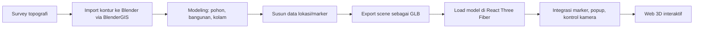

# PRD - Peta 3D Interaktif Agrowisata Perkebunan

2026-09-18 · @Someone

## 1. Latar Belakang & Tujuan

Perkebunan di lahan perbukitan akan dikembangkan menjadi kawasan agrowisata. Saat ini belum ada media yang menggambarkan rencana pembangunan secara jelas dan menarik — baik untuk keperluan presentasi ke investor/stakeholder, maupun sebagai alat kerja teknis tim untuk desain dan perhitungan lapangan.

**Tujuan proyek:**

- Membuat peta 3D perencanaan agrowisata yang menampilkan kontur tanah, pohon, bangunan, dan kolam secara akurat.
- Menghasilkan web 3D interaktif bergaya peta wisata (referensi: Ancol.com/peta), tapi dalam bentuk scene 3D yang bisa dijelajahi, bukan ilustrasi 2D datar.
- Peta ini berfungsi ganda: (1) alat presentasi yang memikat untuk investor/stakeholder, dan (2) alat kerja teknis untuk perencanaan pembangunan (tata letak, perhitungan luas area, dsb).

## 2. Target Pengguna

| Pengguna | Kebutuhan utama |
| --- | --- |
| Investor / stakeholder | Melihat rencana pembangunan secara menarik dan meyakinkan tanpa perlu kunjungan fisik ke lokasi |
| Tim teknis internal | Alat kerja untuk desain tata letak, perhitungan luas area, dan validasi rencana terhadap kontur asli |
| Calon pengunjung (pasca-launching) | Menjelajahi peta kawasan agrowisata sebelum berkunjung, mencari lokasi wahana/fasilitas |

## 3. Ruang Lingkup

**Termasuk (v1):**

- Model terrain 3D kawasan (kontur, pohon, bangunan, kolam) hasil digitalisasi dari Blender
- Web 3D interaktif dengan kamera bergaya peta (pan/zoom), marker per lokasi, popup info, filter kategori, dan pencarian lokasi
- Data lokasi (koordinat, kategori, konten popup) terpusat dalam satu sumber data

**Tidak termasuk (v1) — dipertimbangkan untuk fase berikutnya:**

- Peta geografis dunia nyata untuk petunjuk arah dari luar lokasi (akan pakai layanan peta terpisah bila dibutuhkan)
- GPS tracking real-time pengunjung di lapangan
- Fitur booking/transaksi online
- Versi multi-bahasa

## 4. Fitur Utama

Semua fitur diadaptasi dari referensi Ancol.com/peta, dibangun dalam bentuk 3D interaktif (bukan ilustrasi 2D).

| Fitur | Deskripsi | Implementasi teknis |
| --- | --- | --- |
| Marker/hotspot lokasi | Penanda 3D di tiap titik (kebun, kolam, bangunan) yang menempel di permukaan terrain | Objek 3D kecil diposisikan pada koordinat X,Y,Z hasil export Blender |
| Popup info | Kartu info (foto, deskripsi, detail) muncul saat marker diklik, mengikuti posisi 3D-nya | Komponen `Html` dari `@react-three/drei`, dipicu lewat raycasting `onClick` |
| Zoom & pan kamera | Navigasi peta natural: geser, perbesar/perkecil, tanpa rotasi bebas berlebihan | `MapControls` dari `@react-three/drei` |
| Filter kategori | Menyalakan/mematikan grup marker per kategori (kebun, fasilitas, air, dll) | State React per kategori + rendering kondisional grup objek |
| Pencarian lokasi | Cari nama lokasi, kamera otomatis "terbang" ke titik tersebut | Lookup di data lokasi + animasi kamera (lerp/tween) |
| Rute antar titik | Jalur visual dari satu titik ke titik lain mengikuti kontur tanah | `Line` dari `@react-three/drei`, titik jalur menempel ke ketinggian terrain |

## 5. Arsitektur & Tech Stack

| Layer | Tools | Catatan |
| --- | --- | --- |
| Modeling & terrain | Blender + addon BlenderGIS | Kontur, pohon, bangunan, kolam dimodelkan lalu diekspor sebagai glTF/GLB |
| Frontend web | Next.js | Framework React untuk struktur halaman dan routing |
| Rendering 3D | React Three Fiber (Three.js) + `@react-three/drei` | Scene, kamera, marker, popup HTML, kontrol navigasi |
| Data lokasi | JSON/data file terpisah | Koordinat, kategori, konten popup tiap titik — lihat bagian Struktur Data |

**Kenapa tanpa Mapbox/Leaflet:** library peta konvensional dirancang untuk tile geografis dunia nyata (lat/lng global), bukan model 3D custom hasil Blender. Semua kebutuhan (terrain, kamera, marker, popup) sudah tercakup native di ekosistem Three.js/R3F tanpa perlu menggabungkan dua sistem rendering.

**GPS tracking custom:** bila dibutuhkan pelacakan posisi pengunjung real-time di lapangan, data lat/lng dari perangkat GPS dikonversi ke koordinat lokal X,Z scene lewat fungsi kalibrasi manual (bukan lewat layanan peta pihak ketiga, karena skala lokasi kecil dan lokal).

## 6. Struktur Data

Data lokasi disimpan terpisah dari kode (JSON), supaya mudah diupdate tanpa mengubah komponen React.

```json
{
  "id": "kolam-01",
  "nama": "Kolam Utama",
  "kategori": "air",
  "posisi": { "x": 12.5, "y": 0.8, "z": -34.2 },
  "deskripsi": "Kolam pemancingan dengan kapasitas 50 pengunjung",
  "foto": "/assets/kolam-01.jpg",
  "jamOperasional": "08:00 - 17:00"
}
```

**Field kunci:**

- `id` — pengenal unik tiap titik
- `kategori` — dasar untuk fitur filter (kebun, fasilitas, air, bangunan, dll)
- `posisi` — koordinat X,Y,Z sesuai skala model 3D hasil export Blender
- `deskripsi`, `foto`, `jamOperasional` — konten yang tampil di popup info

## 7. Alur Kerja / Pipeline



Catatan: data survey topografi asli belum tersedia saat proyek dimulai — tahap A perlu dituntaskan sebelum modeling kontur di Blender bisa akurat.

## 8. Roadmap & Milestone

| Fase | Kegiatan | Status |
| --- | --- | --- |
| 1. Persiapan data | Survey topografi lahan, pengumpulan data kontur | ⏳ Menunggu survey |
| 2. Modeling dasar | Belajar Blender + BlenderGIS, import kontur, modeling dasar terrain | ⏳ Menunggu data survey |
| 3. Modeling detail | Tambah pohon, bangunan, kolam sesuai rencana tata letak | ⏳ Menunggu fase 2 |
| 4. Struktur data | Susun daftar lokasi/marker beserta kategori dan konten popup | ✅ Selesai — `src/data/lokasi.ts` (10 lokasi placeholder) |
| 5. Setup web | Setup project Next.js + React Three Fiber, load model GLB ke scene | ✅ Selesai — lihat catatan di bawah |
| 6. Fitur interaktif | Implementasi marker, popup, kontrol kamera, filter, pencarian, rute | ✅ Selesai (marker, popup, filter, search, fly-to camera) |
| 7. Uji & polish | Uji performa, penyesuaian tampilan, uji coba ke calon pengguna (investor/tim teknis) | ⏳ Menunggu model GLB final |

**Catatan Fase 5 & 6 (selesai 2026-09-18):**

Infrastruktur web 3D sudah berjalan di route `/peta` (publik, tanpa login):
- `three` + `@react-three/fiber` + `@react-three/drei` terinstal
- Scene full-screen dengan `MapControls` (pan/zoom bergaya peta, tanpa rotasi bebas)
- Langit siang hari (`Sky`), pencahayaan directional + ambient + hemisphere
- Terrain placeholder (plane datar + grid helper) — siap diganti GLB Blender
- Marker 3D per lokasi (warna berbeda per kategori, animasi bobbing + hover scale)
- Popup info HTML (`<Html>` drei) dengan nama, deskripsi, jam operasional
- Zustand store (`src/store/peta.store.ts`) untuk state: selectedLokasi, visibleKategori, kameraTarget
- Panel kontrol floating (pojok kiri atas): search autocomplete + filter kategori toggle
- Animasi kamera fly-to (lerp) saat user memilih lokasi dari search

**Langkah penggantian terrain ke GLB Blender (saat model tersedia):**
1. Letakkan file di `public/models/terrain.glb`
2. Ganti `TerrainPlaceholder` di `PetaCanvas.tsx` dengan `useGLTF('/models/terrain.glb')`
3. Update koordinat `posisi` di `src/data/lokasi.ts` sesuai koordinat aktual Blender

## 9. Risiko & Batasan

- **Performa web 3D** — model terrain kompleks (banyak pohon/detail) bisa berat di-load di browser, terutama di perangkat mobile; perlu optimasi (LOD, kompresi model) sejak awal.
- **Ketergantungan data survey** — akurasi kontur 3D bergantung pada data topografi asli lahan, yang belum tersedia saat proyek dimulai.
- **Kurva belajar tim** — level pengalaman software 3D/GIS masih pemula, sehingga tahap modeling di Blender berpotensi memakan waktu lebih lama dari perkiraan.
- **Kalibrasi GPS-ke-scene** — bila fitur GPS tracking custom dikembangkan, perlu proses kalibrasi manual yang presisi karena tidak memakai sistem koordinat global standar.
